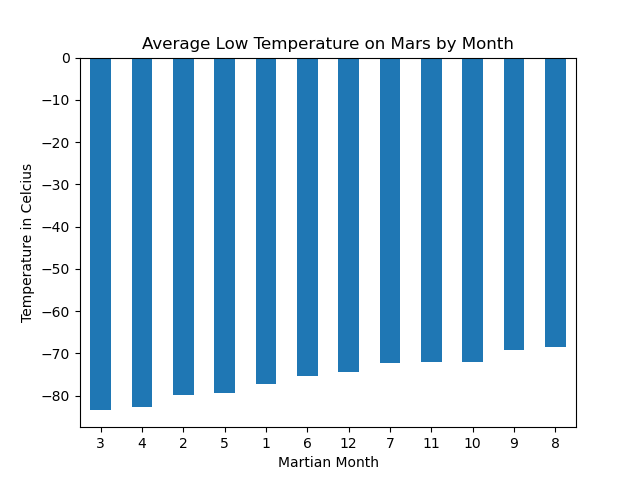
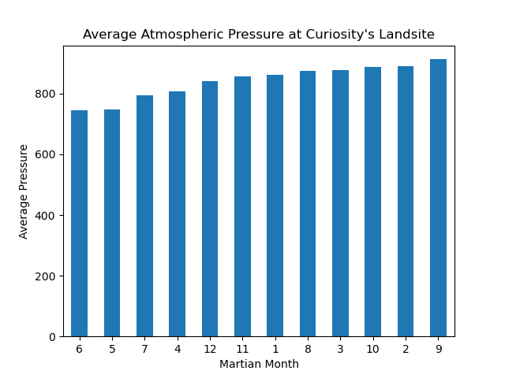
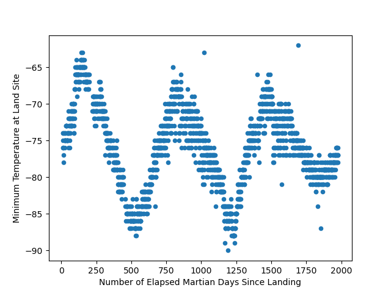

# webscraping-challenge

## Deliverable 1: 
### A Jupyter notebook containing code that scrapes the Mars news titles and preview text.
Automated browsing (with Splinter) was used to visit the Mars news site, and the HTML code was extracted (with Beautiful Soup). 
The titles and preview text of the news articles were scraped and extracted. 
The scraped information was stored in the specified Python data structure—specifically, a list of dictionaries.

## Deliverable 2: 
### A Jupyter notebook containing code that scrapes the Mars weather data and that cleans, visualizes, and analyzes that data.
The HTML table was extracted into a Pandas DataFrame. Pandas, Splinter, and Beautiful Soup were used to scrape the data. 
The columns have the correct headings and data types. 
Questions below are answered and Dataframe is exported to CSV. 

## Analysis :
### The data was analyzed to answer the following questions:
Q1: How many months exist on Mars?
A1: There are 12 months on Mars. 

Q2: How many Martian days' worth of data are there?
A2: There are 1867 Martian days' worth of data.

Q3: Which month, on average, has the lowest temperature? The highest? 
A3: 
The coldest average temperature was -83.31 in Martian month 3.
The hottest average temperature was -68.38 in Martian month 8.

Q4: Which month, on average, has the lowest atmospheric pressure? The highest? 
A4: 
The highest pressure was 913.31 in Martian month 9.
The lowest pressure was 745.05 in Martian month 6.

Q5: How many terrestrial days exist in a Martian year? (A visual estimate within 25%)
A5:
Based on three peak temperature seasons in the dataset, there are approximately 674 Earth days in a Martian year.
This bears out as a close estimate. There are actually 687 days in a Martian year.
Citation: https://science.nasa.gov/resource/mars-in-a-minute-how-long-is-a-year-on-mars/

Resources :
--EDX Mar 2024  Cohort- Lecture 11.2, TED Duncan, Sherone Grant

--The Mars News websiteLinks to an external site. is operated by edX Boot Camps LLC for educational purposes only. The news article titles, summaries, dates, and images were scraped from NASA's Mars NewsLinks to an external site. website in November 2022. Images are used according to the JPL Image Use PolicyLinks to an external site., courtesy NASA/JPL-Caltech.